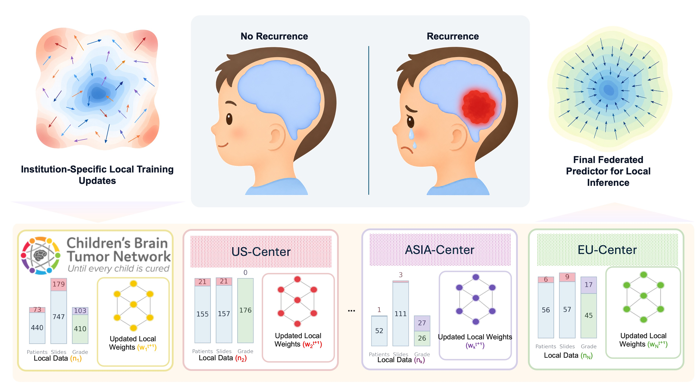

<h1 align="center">Privacy-Preserving Federated Distillation of Foundation Models
  for Multi-Institutional Pediatric Glioma Recurrence Prediction</h1>

<p align="center">
  <em>Federated Assessment of Brain tumor Recurrence In Children (Fabric)</em>
</p>
<p align="center">
  Jiying Wang<sup>*</sup> · Anbang Liu<sup>*</sup> · Zheyi Ji · Philip Chikontwe<br>
  Jiancheng Yang · Biyue Zhu · Peter Pytel · Sudarshawn Damodharan<br>
  Ziyue Xu · Kun-Hsing Yu · Samuel L. Volchenboum · Junhan Zhao<sup>+</sup>

<sup>*</sup> Co-first authors, contributed equally.<br>
<sup>+</sup> Corresponding author: [junhanzv@uchicago.edu](mailto:junhanzv@uchicago.edu)<br>
<sup>+</sup> Partially supported by Nvidia Academic Grant (J.Z.) and Cancer Research Foundation Young Investigator Award (J.Z.).
</p>

<br>
<p align="center">
   
</p>
<p align="center">
  
  &nbsp;&nbsp;
  
  &nbsp;&nbsp;
  
   
</p>
<br>


<p align="center">
  <a href="#-news">News</a> ·
  <a href="#abstract">Abstract</a> ·
  <a href="#results">Results</a> ·
  <a href="#quickstart">Quickstart</a> ·
  <a href="#training">Training</a> ·
  <a href="#data-availability">Data</a> ·
  <a href="#citation">Citation</a>
</p>


## 🏆 News

> **FABRIC was accepted for an oral presentation at the MICCAI 2026 PedAItrics Workshop!** 🎉

## Abstract

**804** patients · **4** cohorts · **3** federated clients · **2** histology foundation models

Pediatric glioma recurrence risk at diagnosis can inform imaging surveillance, treatment escalation, and follow-up planning. Diagnostic hematoxylin and eosin (H&E) whole-slide images provide cellular and tissue-level evidence that complements longitudinal MRI, but recurrence-positive cases are scarce at individual institutions. FABRIC (Federated Assessment of Brain tumor Recurrence In Children) combines pathology foundation-model features, multiple-instance learning, and federated optimization to learn patient-level recurrence risk without centralizing source slides or patient records.

The study evaluates 804 patients from four cohorts in the United States, Europe, and Asia. Diagnostic H&E patches are encoded by frozen UNI or Virchow2 foundation models and grouped into patient-level bags. FABRIC supports two selectable MIL variants, `pooling` and `topk`, within the same NVIDIA FLARE workflow. Three federated clients train locally and contribute to patient-count-weighted FedAvg.

This repository provides FABRIC training and evaluation with NVIDIA FLARE 2.7.2. Both variants use pre-extracted features, patient-level five-fold cross-validation, and the same federated training settings.

## Why FABRIC

- **Rare-disease collaboration**: federated training combines recurrence signal distributed across four pediatric glioma cohorts without placing their source records in this repository.
- **Focused histology modeling**: pseudo-bag training reduces the effect of very large, heterogeneous bags and emphasizes localized recurrence-relevant morphology.
- **Foundation-model comparison**: the same patient labels, folds, optimizer, FL protocol, and metrics are used with frozen UNI and Virchow2 patch representations.
- **Patient-level evaluation**: all H&E slides from one patient form one bag; train and test membership is separated by patient, and the five test folds cover the cohort exactly once.
- **Reproduction safeguards**: the runner validates inputs, client identity, seeds, tensor specifications, server rounds, and the final NVIDIA FLARE checkpoint before accepting results.

This repository covers input validation, NVIDIA FLARE job construction, local client training, server aggregation, final-fold evaluation, and five-fold summary generation. It consumes existing features and does not rerun slide preprocessing or feature extraction.

## Resources

| Item | Availability |
| --- | --- |
| Main entry point | [`fabric/run_fabric.py`](fabric/run_fabric.py) |
| UNI configuration | [`configs/uni.json`](configs/uni.json) |
| Virchow2 configuration | [`configs/virchow2.json`](configs/virchow2.json) |
| Environment lock | [`configs/environment-lock.json`](configs/environment-lock.json) |
| Data schema | [`docs/DATA_FORMAT.md`](docs/DATA_FORMAT.md) |
| FLARE workflow | [`docs/NVFLARE_WORKFLOW.md`](docs/NVFLARE_WORKFLOW.md) |
| Reproducibility record | [`docs/REPRODUCIBILITY.md`](docs/REPRODUCIBILITY.md) |

## Results

Five-fold NVIDIA FLARE results for both FABRIC variants are shown below. Values are mean ± sample standard deviation across folds. The Top-k experiments use K = 1 for each high/low set.

| Experiment | Variant | AUC | Balanced accuracy | Accuracy |
| --- | --- | ---: | ---: | ---: |
| FABRIC (UNI) | `pooling` | 0.644 ± 0.038 | 0.629 ± 0.057 | 0.715 ± 0.032 |
| FABRIC (UNI) | `topk` | 0.617 ± 0.053 | 0.572 ± 0.068 | 0.718 ± 0.025 |
| FABRIC (Virchow2) | `pooling` | 0.649 ± 0.018 | 0.622 ± 0.043 | 0.718 ± 0.012 |
| FABRIC (Virchow2) | `topk` | 0.649 ± 0.049 | 0.591 ± 0.059 | 0.709 ± 0.038 |

The unrounded values and reproduction requirements are provided in [`docs/REPRODUCIBILITY.md`](docs/REPRODUCIBILITY.md).

## Data Availability

The study includes 804 pediatric glioma patients, of whom 101 (12.6%) are recurrence-positive. Four cohorts are represented as three federated clients: CBTN and CHCMU are combined as `CBTN_CQU`, HMS is represented as `Harvard`, and DBTA is represented as `EBRAINS`.

| Cohort | Patients | Recurrence-positive | Runtime client |
| --- | ---: | ---: | --- |
| Children’s Brain Tumor Network (CBTN) | 513 | 73 | `CBTN_CQU` |
| Children’s Hospital of Chongqing Medical University (CHCMU) | 53 | 1 | `CBTN_CQU` |
| Harvard Medical School (HMS) | 176 | 21 | `Harvard` |
| Digital Brain Tumour Atlas (DBTA) | 62 | 6 | `EBRAINS` |
| **Total** | **804** | **101** | **3 clients** |

CBTN and CHCMU are combined into one client in the study to balance demographic composition across sites. Fold-specific training counts are smaller than the totals above because a different global patient-level test fold is withheld in each cross-validation iteration.

The cohort and its derived files are not redistributed here. Exact numerical reproduction requires the same recurrence labels, patient-level fold assignments, client assignments, slide ordering, and feature tensors used by the verified run.

| Input | Role | Repository status |
| --- | --- | --- |
| Patient manifests | Define labels, client membership, slide order, and five test folds | Private; not tracked |
| UNI features | 1,024-dimensional patch features | Pre-extracted; not tracked |
| Virchow2 features | 2,560-dimensional patch features | Pre-extracted; not tracked |
| Raw whole-slide images | Source material for feature extraction | Not required by this training code |

The reported analyses were approved by the University of Chicago (`IRB25-1531`), Children’s Hospital of Chongqing Medical University (`2023-436`), and Harvard Medical School (`IRB25-0188` for the SmartPath Research Network and `IRB 20-1509`). Data access remains subject to the respective cohort, institution, and governance requirements.

Exact reproduction expects 40 manifest files: two encoders × five folds × four files per fold. Use the following repository-relative layout:

```text
private_data/
├── manifests/
│   ├── uni/
│   │   ├── fold_0/
│   │   └── ... fold_4/
│   └── virchow2/
│       ├── fold_0/
│       └── ... fold_4/
└── features/
    ├── uni/
    └── virchow2/
```

Each fold directory contains:

```text
client_CBTN_CQU_train_manifest.csv
client_Harvard_train_manifest.csv
client_EBRAINS_train_manifest.csv
global_test_manifest.csv
```

The manifests may instead remain in secure external storage. Set their location in `configs/data_paths.local.json`, which is ignored by Git. A path-prefix map can redirect paths already stored in the manifests without changing patient-row or slide ordering. See [`docs/DATA_FORMAT.md`](docs/DATA_FORMAT.md).

## Quickstart

Create the tested environment:

```bash
conda env create -f environment.yml
conda activate fabric-nvflare
```

Alternatively, install the locked Python packages with the CUDA 12.8 PyTorch index appropriate for the host. GPU drivers must be installed separately.

Prepare the local data configuration:

```bash
cp configs/data_paths.example.json configs/data_paths.local.json
```

The supplied example already uses repository-relative paths:

```json
{
  "manifest_root": "private_data/manifests",
  "feature_path_prefix_map": {
    "features_as_stored_in_manifests": "private_data/features"
  }
}
```

The local configuration is ignored by Git and may safely be changed for the current machine.

## Input Validation

Validate the selected variant before a long GPU run. These commands do not start training or create experiment outputs.

### Pooling

The default command validates both encoder configurations, all five folds, patient separation, binary labels, client assignment, and feature-file presence. It does not import the model, initialize CUDA, or start NVIDIA FLARE.

```bash
python -B fabric/run_fabric.py --experiment both
```

### Top-k

Validate the same inputs with the Top-k configuration selected:

```bash
python -B fabric/run_fabric.py --experiment both --variant topk --top-k 1
```

## Training

After input validation succeeds, launch the `pooling` experiments for both encoders:

```bash
bash scripts/run_both.sh reproduction_01
```

The equivalent direct command is:

```bash
python -B -u fabric/run_fabric.py \
  --experiment both \
  --run-name reproduction_01 \
  --execute
```

Run one encoder or selected folds when diagnosing the setup:

```bash
python -B -u fabric/run_fabric.py \
  --experiment uni \
  --folds 0 \
  --run-name uni_fold0_check \
  --execute
```

Important arguments:

- `--experiment`: `uni`, `virchow2`, or `both`
- `--variant`: `pooling` (default) or `topk`
- `--top-k`: positive number of high and low patches selected per pseudo-bag; only valid with `--variant topk`, default `1`
- `--folds`: one or more fold indices from 0 through 4
- `--run-name`: output-directory name; an existing run requires `--resume`
- `--resume`: continue an existing run from verified global-round checkpoints and skip completed folds; requires the original run name and matching model/data settings
- `--data-config`: local manifest and feature-path configuration; defaults to `configs/data_paths.local.json`
- `--execute`: required to start NVIDIA FLARE and model training

To run the `topk` model with both encoders, use a separate run name:

```bash
python -B -u fabric/run_fabric.py \
  --experiment both \
  --variant topk --top-k 1 \
  --run-name topk_01 \
  --execute
```

Use `--variant pooling` for the pooling experiments, or omit `--variant`. Omitting
`--execute` validates inputs and prints the selected setup without starting training.
Both variants reuse the same feature files and patient manifests. Use a separate
run name for each experiment and load checkpoints with the corresponding variant.

To continue an interrupted run in the same result directory:

```bash
python -B -u fabric/run_fabric.py \
  --experiment both --variant topk --top-k 1 \
  --run-name topk_01 --resume --execute
```

Use the same run name, code version, model variant, and settings. For pooling,
use `--variant pooling` and omit `--top-k`. Completed folds are skipped; an
incomplete round restarts from the last verified global checkpoint. Omit
`--execute` to inspect the recovery plan. Details are in
[`docs/NVFLARE_WORKFLOW.md`](docs/NVFLARE_WORKFLOW.md).

The experiment settings are:

| Setting | UNI | Virchow2 |
| --- | ---: | ---: |
| Input dimension | 1,024 | 2,560 |
| MIL embedding dimension | 512 | 512 |
| Attention dimension | 256 | 256 |
| Pseudo-bags | 8 | 8 |
| Global rounds | 5 | 5 |
| Local epochs per client per round | 5 | 5 |
| Batch size | 32 | 32 |
| Maximum instances per patient | 4,000 | 4,000 |
| Optimizer | Adam | Adam |
| Learning rate | 1e-5 | 1e-5 |
| Weight decay | 1e-4 | 1e-4 |

The model produces two logits and uses client-specific class-weighted cross-entropy. AUC is computed from the continuous recurrence probability; balanced accuracy and accuracy use a threshold of 0.5.

Durable outputs are written below:

```text
results/<run-name>/
├── uni/
│   ├── fold_0/ ... fold_4/
│   ├── fold_results.tsv
│   └── mean_std_summary.tsv
├── virchow2/
│   ├── fold_0/ ... fold_4/
│   ├── fold_results.tsv
│   └── mean_std_summary.tsv
└── completed.json
```

Each fold stores the exported NVIDIA FLARE job, simulator workspace and log, 15 client-update records, five server aggregation audits, final checkpoint, patient-level predictions, and fold metrics. Short-lived local IPC files use `.tmp/`. Both `results/` and `.tmp/` are ignored by Git.

Runtime depends on the variant, feature storage, GPU, CUDA, and cuDNN behavior. Progress lines report completed work, elapsed time, and ETA for the current client task or fold sequence.

## Checkpoint Evaluation

Evaluation runs automatically after the fifth global round of each fold. The
runner verifies the saved global model and round records, evaluates the held-out
patient fold, and writes the fold metrics and five-fold summary. AUC uses continuous
recurrence probabilities; balanced accuracy and accuracy use a threshold of 0.5.

See [`docs/NVFLARE_WORKFLOW.md`](docs/NVFLARE_WORKFLOW.md) for validation details
and [`docs/TROUBLESHOOTING.md`](docs/TROUBLESHOOTING.md) for recovery instructions.

## Loading A Trained Model

The final checkpoint for each fold is `global_model_round_final.pt`. The following example reconstructs the matching architecture and loads every tensor strictly:

```python
import sys
from pathlib import Path

import torch

repo = Path.cwd().resolve()
sys.path.insert(0, str(repo / "fabric"))

from fabric_common import load_core, load_setup, training_args

experiment = "uni"
run_dir = repo / "results" / "reproduction_01" / experiment
checkpoint_path = run_dir / "fold_0" / "global_model_round_final.pt"

checkpoint = torch.load(checkpoint_path, map_location="cpu", weights_only=True)
saved_settings = checkpoint["config"]["settings"]
setup = load_setup(repo, experiment, saved_settings.get("model_variant", "pooling"),
                   saved_settings.get("dtfd_top_k"))
core = load_core()
args = training_args(repo, setup, run_dir)
model = core.training.build_model(setup["model_name"], setup["input_dim"], args)

model.load_state_dict(checkpoint["model_state_dict"], strict=True)
model.eval()
```

Use `experiment = "virchow2"` for the 2,560-dimensional Virchow2 model. To load Top-k, set `run_dir` to its run directory (for example, `results/topk_01/uni`); the saved settings select the matching variant automatically. The checkpoint does not contain patient manifests or feature arrays.

## NVIDIA FLARE Execution

The four cohorts map to three NVIDIA FLARE clients:

| NVIDIA FLARE client | Cohort represented |
| --- | --- |
| `CBTN_CQU` | CBTN + CHCMU |
| `Harvard` | HMS |
| `EBRAINS` | DBTA |

The workflow is:

1. initialize the selected FABRIC model for the encoder and fold
2. export one NVIDIA FLARE `FedAvgRecipe` containing the server code and all three client apps
3. send the same full global state dictionary to `CBTN_CQU`, `Harvard`, and `EBRAINS`
4. train each client for five local epochs with its own patient data and deterministic client seed
5. return full PyTorch parameters, training loss, and client metadata
6. aggregate all three updates in fixed site order, weighted by training-patient count
7. repeat for five global rounds and evaluate the round-5 aggregate

The supplied configuration runs three logical clients sequentially on one GPU
through NVIDIA FLARE's local simulator. Each exported job includes its runtime
modules. See [`docs/NVFLARE_WORKFLOW.md`](docs/NVFLARE_WORKFLOW.md).

## Method Sketch

FABRIC combines three components:

1. **Foundation-model feature extraction.** Diagnostic H&E WSIs are tiled into patches. Frozen UNI or Virchow2 encoders transform the patches into 1,024- or 2,560-dimensional embeddings.
2. **Patient-level MIL.** All available slides from a patient form one feature bag. The selected pooling or Top-k variant aggregates these features into a patient-level recurrence prediction.
3. **Federated optimization.** Each client initializes from the current global parameters, minimizes a class-weighted cross-entropy loss locally, and returns model parameters. The server computes a sample-size-weighted average, where each client weight is proportional to its number of training patients.

### Model Variants

FABRIC offers two MIL variants, selected with `--variant`:

- **Pooling** uses attention-weighted feature aggregation for patient-level prediction.
- **Top-k** scores pseudo-bags, selects high- and low-scoring patches within each
  group, and aggregates the selected patch features with a second MIL tier.
  K defaults to **1** for each high/low set. Training uses patient cross-entropy
  plus pseudo-bag cross-entropy with coefficient **1.0**.

The pseudo-bag feature-distillation design builds on [DTFD-MIL](https://github.com/hrzhang1123/DTFD-MIL).
Both variants use the same patient folds, pre-extracted features, and NVIDIA FLARE
training workflow. Detailed settings are in
[`docs/EXPERIMENT_SETUP.md`](docs/EXPERIMENT_SETUP.md).

## Reproducibility and Privacy

**No patient-level tables or individual patient values are tracked in this public
repository.** Only aggregate study statistics and evaluation results are reported.
Patient and slide identifiers, labels, manifests, feature tensors, medical images,
predictions, checkpoints, and local data-path configuration remain outside Git.
Keep these files in the ignored data and result directories; do not force-add them.

NVIDIA FLARE exchanges model parameters, training loss, and training metadata;
raw patient records, slides, and feature bags are not sent as model updates.
Standard FedAvg alone does not provide a formal guarantee against information
leakage from model updates.

Exact numerical reproduction requires the same private inputs and a compatible
software and hardware environment. See [`docs/REPRODUCIBILITY.md`](docs/REPRODUCIBILITY.md).
FABRIC is intended for research use.

## Citation

If you use this repository, please cite the associated FABRIC paper. Citation details will be added after publication.
